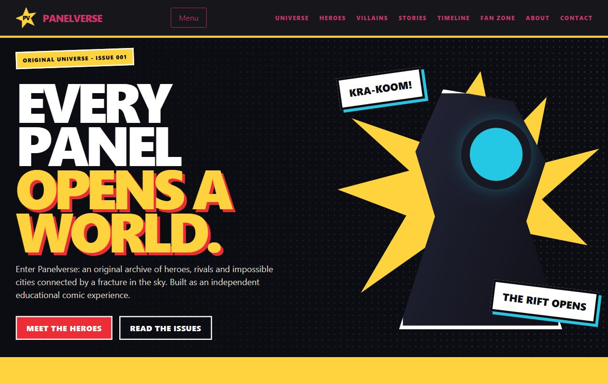
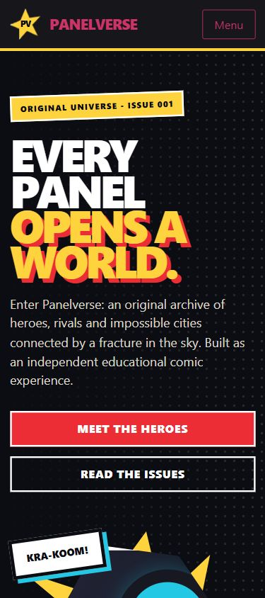
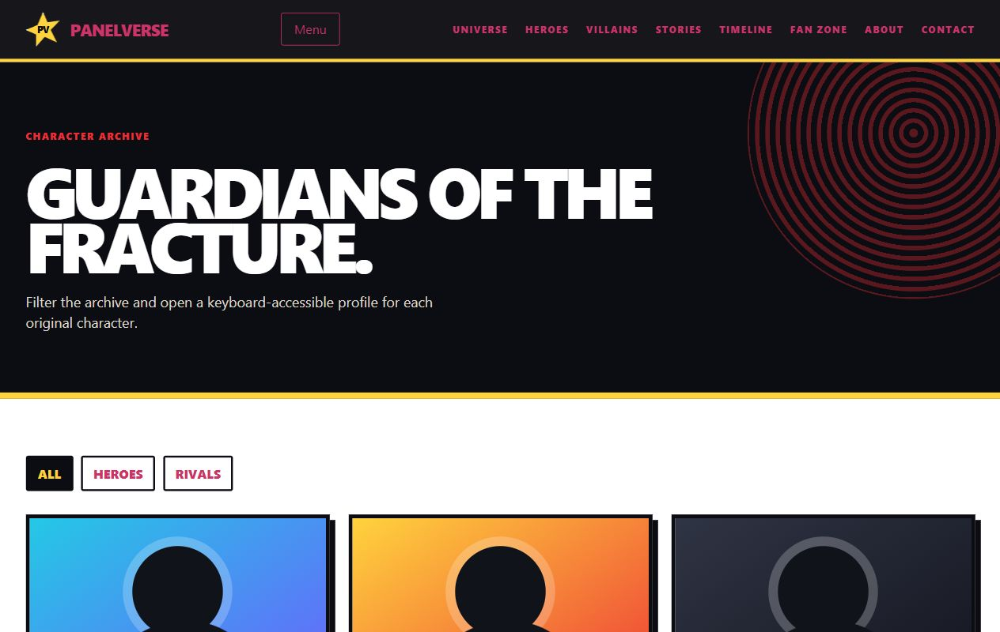
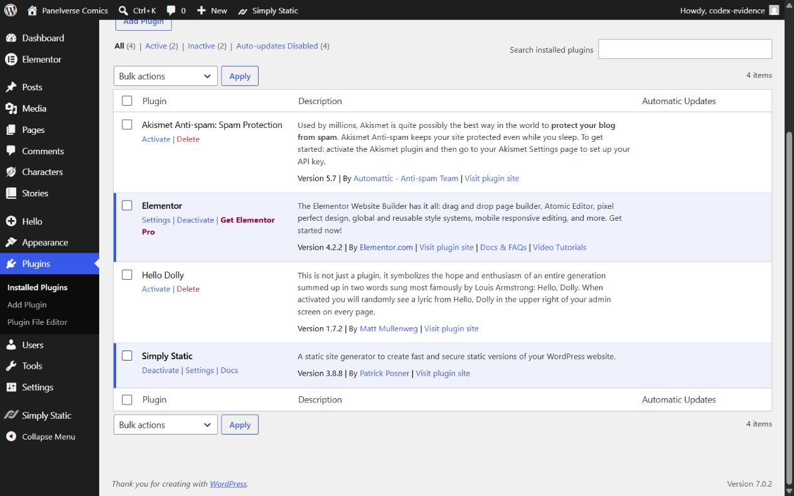

# Panelverse Comics

Panelverse Comics replaces the former Prompt & Pixel interface with an original educational comic universe. It was developed privately with WordPress and Elementor, exported through Simply Static, and deployed at the existing repository and GitHub Pages URL.

Panelverse is an independent educational concept. It is not affiliated with, endorsed by, or connected to Marvel Entertainment. It uses no Marvel characters, logos, stories, artwork, or copied interface layouts.

## Live site

[Open Panelverse Comics](https://mim242-40-002-dot.github.io/prompt-and-pixel-ai/)

[GitHub repository](https://github.com/mim242-40-002-dot/prompt-and-pixel-ai)

## Principal pages

- Home, Universe, Heroes, Villains, Stories, Timeline, Fan Zone, About, and Contact
- Original character archive featuring Nova Circuit, Rift Runner, Vanta Echo, Verdant Warden, Null Crown, and Red Static
- An original story arc, timeline, fan-zone prompts, and non-transmitting contact form

## WordPress and Elementor development

The private development stack uses WordPress 7.0.2, PHP 8.3.33, MariaDB 10.11, Hello Elementor, the custom Panelverse child theme, Elementor Free 4.2.2, and Simply Static 3.8.8. Elementor data is stored for all nine pages, with sanitized reusable template JSON and a WordPress WXR export retained as evidence.

Safe evidence in the repository includes:

- Child-theme PHP, CSS, JavaScript, and original CSS/SVG visual systems
- Sanitized WXR content and nine Elementor template files
- Plugin/theme manifest, development notes, screenshots, and export instructions

No database, SQL dump, WordPress core, installed plugin core, local configuration, secret, cache, or credential is versioned.

## Design and features

- Original comic-panel composition, halftone fields, symbols, and abstract character artwork
- Character alignment filters and keyboard-accessible profile dialogs
- Responsive panel layouts and mobile navigation
- Interactive story timeline and honest static fan/contact forms
- Cinematic but restrained animation with a `prefers-reduced-motion` fallback
- Skip link, semantic landmarks, visible focus states, labelled controls, and high-contrast presentation

## Static deployment architecture

WordPress is used only for private content authoring. Simply Static generated the production output using `https://mim242-40-002-dot.github.io/prompt-and-pixel-ai/` as the destination. The repository root contains only the static runtime required by GitHub Pages. It contains no localhost URL, administrator link, PHP requirement, or credential.

## Reproducing the authoring environment

1. Prepare a private WordPress installation with PHP and MariaDB.
2. Install Hello Elementor, Elementor Free, and Simply Static.
3. Copy and activate `wordpress-source/themes/panelverse-child/`.
4. Import the sanitized WXR and optional Elementor JSON templates from `wordpress-evidence/`.
5. Review the responsive and reduced-motion behavior, then configure the exact production destination in Simply Static.
6. Validate URLs, assets, scripts, and forbidden development references before placing the output in the repository root.

No credential or local database is included. The process is documented without exposing private configuration.

## Screenshots

| Desktop | Mobile | Character archive | WordPress/Elementor evidence |
|---|---|---|---|
|  |  |  |  |

The completed export activity is shown in `assets/screenshots/evidence-simply-static.png`.

## Verification

The repository passed structure, heading, anchor, local-target, forbidden-reference, screenshot, and JavaScript syntax checks. Mobile navigation, character filters, dialog focus, profile closing, responsive overflow, and console output were tested in the Codex in-app Chromium browser. No unmeasured performance score or untested browser result is claimed.

## Limitations and future work

The static release has no account, server search, saved fan submission, or database-driven issue reader. Future work could add opt-in persistence through a separate service, expand the original story catalogue, and run broader assistive-technology and cross-browser testing.

## Documentation

- [Project overview](docs/project-overview.md)
- [Architecture](docs/architecture.md)
- [User flow](docs/user-flow.md)
- [Testing](docs/testing.md)
- [Asset credits](docs/asset-credits.md)
- [WordPress development notes](wordpress-evidence/development-notes.md)
- [Static export instructions](wordpress-evidence/static-export.md)

## Author

Jannatun Nur Mim  
Department of Multimedia and Creative Technology  
Daffodil International University, Dhaka, Bangladesh
