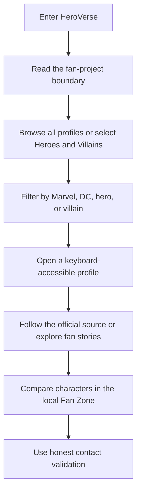

# User flow

```mermaid
flowchart TD
    A[Enter HeroVerse]
    B[Read the fan-project boundary]
    C[Browse all profiles or select Heroes and Villains]
    D[Filter by Marvel, DC, hero, or villain]
    E[Open a keyboard-accessible profile]
    F[Follow the official source or explore fan stories]
    G[Compare characters in the local Fan Zone]
    H[Use honest contact validation]
    A --> B --> C --> D --> E
    E --> F --> G --> H
```

The flow makes publisher ownership and the canon/fan boundary visible before deeper interaction. Local-only features explicitly state that nothing is transmitted or stored.
