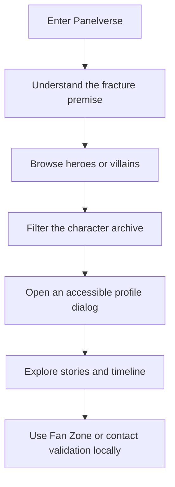

# User flow

```mermaid
flowchart TD
    A[Enter Panelverse]
    B[Understand the fracture premise]
    C[Browse heroes or villains]
    D[Filter the character archive]
    E[Open an accessible profile dialog]
    F[Explore stories and timeline]
    G[Use Fan Zone or contact validation locally]
    A --> B --> C --> D --> E --> F --> G
```

The sequence balances world-building with task clarity and keeps non-transmitting fan/contact interactions explicit.
